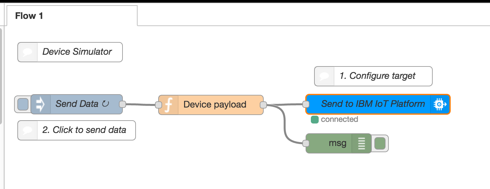
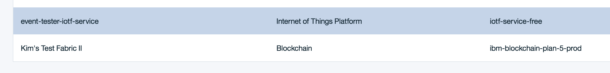

# An End to End Test of the IoT Platform and A Smart Contract

This is an example of how a simple end to end IoT Blockchain test might be constructed and executed using IBM Bluemix. Components
required are:

- a device simulator written in node-red to send random bursts of messages periodically
- an IoTP route from the device's topic to a smart contract in a blockchain
- a Bluemix Hyperledger fabric
- a smart contract running on the fabric

## Node-Red Device simulator

First, you need a device flow that sends a device event to the IoT Platform. This can be set up by 
following the instructions in the article 
[Creating and connecting a Node-RED device simulator](https://console.ng.bluemix.net/docs/services/IoT/nodereddevice_sample.html)
in the [IBM Bluemix Docs page for the Watson IoT Platform](https://console.ng.bluemix.net/docs/services/IoT/index.html?pos=2).

I did not change the standard flow, which looks like this:


*Diagram 1: Node-Red Device Simulator Flow*

I have the `Send Data` node set to send a message through every 8 seconds. The payload is set to true,
but it could be set to anything as the payload is not used by the `Device payload` node.

The `Device payload` node is a simple JavaScript message generator that sends a burst of messages of random length
from 0 through 10. This simulates a real-world load where there are messages that may arrive in groups with short periods
of inactivity in between bursts. The function used to generate the bursts (which you will remember is triggered externally
every 8 seconds) looks like:

``` JavaScript
// Array of pseudo random tilts
var tilt = [-2,-1.5,-91,0,180,180,0,89,90,91];

// Array of pseudo random gforces
var gforce = [0,1,0,0,0,3,0,0,0,2.1];

// array of assetIDs
var assets = ["00001", "00002", "00003", "00004", "00005", "00006", "00007", "00008", "00009", "00010"];

// random number of events to send this interval
var numevts = Math.floor(Math.random()*assets.length);

for (i=0; i<numevts; i++) {
    var iasset = Math.floor(Math.random()*assets.length);
    var itilt = Math.floor(Math.random()*tilt.length);
    var igforce = Math.floor(Math.random()*gforce.length);
    var lat = Math.random() * (46 - 44) + 44;
    var long = Math.random() * (-80 + 71) -80;
    // Create MQTT message in JSON
    msg = {
      payload: JSON.stringify(
        {
          d:{
            "skit" : assets[iasset],
            "force" : gforce[igforce],
            "tilt" : tilt[itilt],
            "location" :
            {
              "longitude" : lat,
              "latitude" : long
            },
          }
        }
      )
    };
    node.send(msg);
}
```

Blockchain asset IDs are defined in an array, and there are 10 of them. The asset array length is
used to set the upper boundary of message count for each burst. The loop sends a single random 
message for each loop. The output device message can be of almost any format, since the IoTP 
mapping function will correctly format the outgoing contract event based on the contract's schema.
A relatively standard MQTT device format is used here.

The property data is pseudo-randomized in that each possibility is defined explicitly in an array,
excepting geo-location, which is bounded to the west by Toronto, to the north by Ottawa, to the east by Montreal,
and to the south by upper New York State. For all but the geolocation, the 

- `skit` is the Surgical Kit's identifier
- `force` is intended to carry the maximum gforce experienced during the sample interval for a Surgical Kit,
which can indicate thet the kit was dropped
- `tilt` is intended to carry the maximum tilt angle experienced during the sample interval, which can 
indicate that the kit is lying on its back or standing on edge and leaning
- `location` is used in the track and trace contract for geofencing, but this sample does not contain the
fence data, so the geo-fencing alert feature is not active during this test

Note that the first event for any kit ID will create the first asset state, making use of the default platform 
behaviour *create on first update*.

Once the node-red simulator is created and connected to the IoT Platform, simply click the injection button on 
the left of the `Send data` node and the flow will be executed every 8 seconds until stopped.

## IoTP route

Although the device and the contract are both running on IBM Bluemix, an IoTP route is independent of their locations.
An IoTP route connects an IoTP MQTT topic to a blockchain fabric that is identified by the
URL of one of its peers. The services are shown here in Bluemix:


*Diagram 2: IoTP and Blockchain Services on IBM Bluemix*

And the route configuration is shown here:


