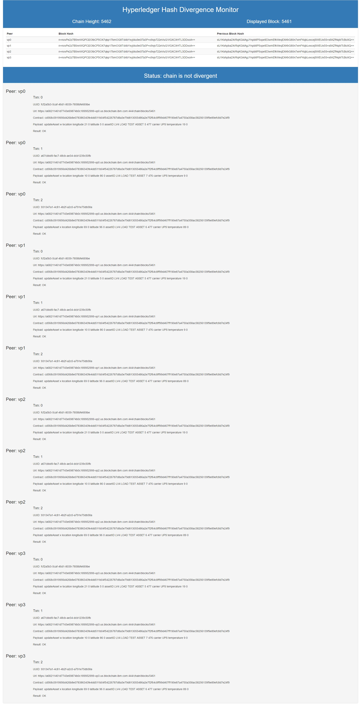

# Hyperledger Hash Divergence Monitor

## How This Flow Works

The primary flow is called "DivergentBlockChain" and is responsible for checking to see if the chain id divergent (as in corrupted) and then finding the block and transaction that caused the corruption.

You configure a minimum of 3 peer URLs pointing to members of the same Hyperledger fabric. You can then set your injection node to run the flow only once, or to run the flow periodically. Note that it takes a minimum of 20s to find a divergent block, so it is a good idea to have the polling timer set at a minute or more. 

The flow retrieves the hash and previous hash values from the top of the chain using the <url>/chain REST command and calculates whether there is divergence. If there is, it then launches a binary search for the first divergent block and reports on the contents of that block (transactions and their errors), decoding the chaincode ID and payload in order to help point to the area of investigation most likely to bear fruit on determining the cause of the chaincode divergence.

The flow writes results to a file in a sub folder based off the folder in which you started node-red. The folder is called status, and the file is called `status.json`.

## settings.js

Node-red uses a default `settings.js` file to configure the execution environment, and this can be overridden, as shown in the next section with the -s parameter. This project overrides that with `divergentBC.js`.

## Starting Node-Red to Use This Flow

While in the folder where you have dropped the flow (which can be the folder in which you have forked this project from blockchain-samples), you can issue a command similar to this Windows 10 example:

`C:\Users\kim\DEV\divergentBC>node-red -s divergentBC.js --userDir c:\users\kim\DEV\`

This will start node-red using the divergentBC.json flow file. If you were to change the flow and deploy it, you would change this file and it would start with your changes intact the next time you issued the command.

## Configuring This Flow

The main flow starts with an injection point at the top left and continues through a simple configuration node that defines the set of URLs used in the rest of the flow and the subflows.

For example:

``` json
var peers = [
    "https://<your fabric url for vp0 here>:444",
    "https://<your fabric url for vp1 here>:444",
    "https://<your fabric url for vp2 here>:444",
    "https://<your fabric url for vp3 here>:444",
];
global.set("peers", peers)
```

>Note that you don't need to specify the port if the https default 443 is used.

The injection and configuration nodes can be duplicated so that several fabrics can be monitored, although each will overwrite the status file, so this works best when injecting each configuration manually. This looks like:


## Visualizing the Results

A second flow called "WEB STATUS" provides a simple visualization of the status output by retrieving and formatting the `status.json` file. In order to present the fairly complex dataset in HTML, the function node called `morph` recasts the data into a form that can be easily iterated using mustache format in the HTML template. Bootstrap is used to provide a reasonably modern output format.

The format when a fabric is not divergent looks like this:


And the format when a divergent fabric is displayed looks like this:


Pointing a browser at `http://localhost:1890/status` will show the monitor. The tab in which the monitor displays can be set to refresh periodically for ongoing monitoring. The author does this using the chrome plugin [Auto Refresh](http://64px.com/auto-refresh/ifooldnmmcmlbdennkpdnlnbgbmfalko) to perform this task. While simplistic, it is very effective for such a simple flow.

One last visualization -- multiple transactions. This happens to be a non-divergent fabric, but the results are similar for divergent fabrics as they use the same results creation node and display flow.



## Console Output

This application makes extensive use of the console and it is worth keeping the console visible if your fabric is unreliable and has a lot of errors and timeouts. Following is the output from a successful binary search on a divergent fabric.

``` json
COMPARE HEIGHTS
HEIGHT: 118
chain is not divergent
GET CHAIN HEIGHTS
CHAIN HEIGHTS, HAVE 4/4
COMPARE HEIGHTS
HEIGHT: 118
ENTER BINARY SEARCH
GET BLOCK FROM PEERS: 59
BLOCK [59] RESPONSES, HAVE 4/4
RETURNING HASHES FROM GET BLOCK
[ 'luPveMsUlDu09/pNyQHGRST5mPiInoplRUpMnex5XFSxD22l5O5WXq8R8faJ6ELBtkPMpSEeuahUuoNGuSDtow==',
  '/EAM7fhSPgounB17sPCQtRDHjVDDieh86KLoasUYZNYao2fg0oHIIFzrDWvVJO5J/ACTx+040bapXTaRGXK2Mw==',
  '6xANL1elBpPv2HoHUVtotfl+1O4sTWLhDNNESrAcl5r3LyL3mgqlfsY29Q7ymReI6NkpnqrMu5Xo4KOt1bKjgw==',
  '/EAM7fhSPgounB17sPCQtRDHjVDDieh86KLoasUYZNYao2fg0oHIIFzrDWvVJO5J/ACTx+040bapXTaRGXK2Mw==' ]
NOT SAME
GET BLOCK FROM PEERS: 30
BLOCK [30] RESPONSES, HAVE 4/4
RETURNING HASHES FROM GET BLOCK
[ 'OLvh7gawrcB6tDf0FLZqRsq4Hh+v0Z4op2INrmtObiMcgNJQEv8/ZiadcxTNY7AlLkFw26NUS3m+HqnIUfAsOA==',
  'OLvh7gawrcB6tDf0FLZqRsq4Hh+v0Z4op2INrmtObiMcgNJQEv8/ZiadcxTNY7AlLkFw26NUS3m+HqnIUfAsOA==',
  'RwBwiEEjvaGH1jnhy8ShFaU54/j7SqOoX/A8+5lP0/0LvL0jfKmgdMv2K0bwe0G6nJ3Bxv4LDKw5xMhjRD48GQ==',
  'vgdd37fZ4f/pssYGg2dBbCdnUTJ8ZFo4knuTJJKyTZ0lbtJ3SWOoXdxsqN7x/DQep8u6hYRxWSu8nyCeKNgOkA==' ]
NOT SAME
GET BLOCK FROM PEERS: 16
BLOCK [16] RESPONSES, HAVE 4/4
RETURNING HASHES FROM GET BLOCK
[ 'RmGuVocddQ0Jxb9NKSLJAFlvr4IMgwEg1fXLG0wEiDl+pN4F98AXEr4HQzKgS13lZz54wW/zGE5g0cXEoSXSRQ==',
  'RmGuVocddQ0Jxb9NKSLJAFlvr4IMgwEg1fXLG0wEiDl+pN4F98AXEr4HQzKgS13lZz54wW/zGE5g0cXEoSXSRQ==',
  'RmGuVocddQ0Jxb9NKSLJAFlvr4IMgwEg1fXLG0wEiDl+pN4F98AXEr4HQzKgS13lZz54wW/zGE5g0cXEoSXSRQ==',
  'RmGuVocddQ0Jxb9NKSLJAFlvr4IMgwEg1fXLG0wEiDl+pN4F98AXEr4HQzKgS13lZz54wW/zGE5g0cXEoSXSRQ==' ]
SAME
GET BLOCK FROM PEERS: 23
BLOCK [23] RESPONSES, HAVE 4/4
RETURNING HASHES FROM GET BLOCK
[ 'arHQjUQvjTJRDzMU16ntc/BHLM1XxfLdj6GJbsJ3e1XkMFFaSFABlCfIVl5qI3QagIuVFIYuNghDr7BJhhrapA==',
  'arHQjUQvjTJRDzMU16ntc/BHLM1XxfLdj6GJbsJ3e1XkMFFaSFABlCfIVl5qI3QagIuVFIYuNghDr7BJhhrapA==',
  'arHQjUQvjTJRDzMU16ntc/BHLM1XxfLdj6GJbsJ3e1XkMFFaSFABlCfIVl5qI3QagIuVFIYuNghDr7BJhhrapA==',
  'arHQjUQvjTJRDzMU16ntc/BHLM1XxfLdj6GJbsJ3e1XkMFFaSFABlCfIVl5qI3QagIuVFIYuNghDr7BJhhrapA==' ]
SAME
GET BLOCK FROM PEERS: 27
BLOCK [27] RESPONSES, HAVE 4/4
RETURNING HASHES FROM GET BLOCK
[ 'zbQG/aHmzeaHYRUTYU9Ii8DZ1GG0AVM/+Jot1EgUV3xpx5b1Fw+peuu3FWtNum9iUMIakFkRoTn74UdHLN+Ing==',
  'zbQG/aHmzeaHYRUTYU9Ii8DZ1GG0AVM/+Jot1EgUV3xpx5b1Fw+peuu3FWtNum9iUMIakFkRoTn74UdHLN+Ing==',
  'zbQG/aHmzeaHYRUTYU9Ii8DZ1GG0AVM/+Jot1EgUV3xpx5b1Fw+peuu3FWtNum9iUMIakFkRoTn74UdHLN+Ing==',
  'zbQG/aHmzeaHYRUTYU9Ii8DZ1GG0AVM/+Jot1EgUV3xpx5b1Fw+peuu3FWtNum9iUMIakFkRoTn74UdHLN+Ing==' ]
SAME
GET BLOCK FROM PEERS: 29
BLOCK [29] RESPONSES, HAVE 4/4
RETURNING HASHES FROM GET BLOCK
[ 'RwBwiEEjvaGH1jnhy8ShFaU54/j7SqOoX/A8+5lP0/0LvL0jfKmgdMv2K0bwe0G6nJ3Bxv4LDKw5xMhjRD48GQ==',
  'EQa4k7iqgbTmGYEJlCUMOvKk1Q2hYkpLDp/rkdrckXhs8ZfoVzWmybYHYpieps3cfA49IVkSwvols9dTrSEeEg==',
  'RwBwiEEjvaGH1jnhy8ShFaU54/j7SqOoX/A8+5lP0/0LvL0jfKmgdMv2K0bwe0G6nJ3Bxv4LDKw5xMhjRD48GQ==',
  'RwBwiEEjvaGH1jnhy8ShFaU54/j7SqOoX/A8+5lP0/0LvL0jfKmgdMv2K0bwe0G6nJ3Bxv4LDKw5xMhjRD48GQ==' ]
NOT SAME
GET BLOCK FROM PEERS: 28
BLOCK [28] RESPONSES, HAVE 4/4
RETURNING HASHES FROM GET BLOCK
[ '3Q9S5WR0ZnGbL2vEgf3vnwNJ0WvRLEYuddqAcbDDWTOazVD+MrilNDgxGULc22rWfVT84FxJGnBwWcjKitUhdA==',
  '3Q9S5WR0ZnGbL2vEgf3vnwNJ0WvRLEYuddqAcbDDWTOazVD+MrilNDgxGULc22rWfVT84FxJGnBwWcjKitUhdA==',
  '3Q9S5WR0ZnGbL2vEgf3vnwNJ0WvRLEYuddqAcbDDWTOazVD+MrilNDgxGULc22rWfVT84FxJGnBwWcjKitUhdA==',
  'zbQG/aHmzeaHYRUTYU9Ii8DZ1GG0AVM/+Jot1EgUV3xpx5b1Fw+peuu3FWtNum9iUMIakFkRoTn74UdHLN+Ing==' ]
NOT SAME
DIVERGENT BLOCK: 28
FINAL RESPONSES FROM SEARCH
OUTPUT FROM BINARY SEARCH FLOW
{
  "_msgid": "2332e0f0.dccd2",
  "topic": "",
  "payload": {
    "responses": {
      "_msgid": "2332e0f0.dccd2",
      "topic": "",
      "payload": {
        "responses": [
          {
            "topic": "peer",
            "peername": "vp0",
            "url": "https://9c0c5c00-b013-4251-8d1a-1562b02491f9_vp0.us.blockchain.ibm.com/chain/blocks/28",
            "_msgid": "2332e0f0.dccd2",
            "statusCode": 200,
            "headers": {
              "access-control-allow-headers": "accept, content-type",
              "access-control-allow-origin": "*",
              "content-type": "application/json",
              "date": "Thu, 20 Oct 2016 16:26:41 GMT",
              "content-length": "1953",
              "connection": "close",
              "server": "nghttpx nghttp2/1.12.0",
              "via": "1.1 nghttpx"
            },
            "payload": {
              "transactions": [
                {
                  "type": 2,
                  "chaincodeID": "EoABY2Q1NjhjMDkxOTk1NmQ0MjZiOGUwNzgzODYzNDNmZTRkZDUxMWIwNGY1NDIyNjc4N2Q4YTNlNzlkODEzMDU1NDg2YTJl
N2YyZjY0YzhmZjk5ZDQ2N2ZmMTkwZTg3YTQ3NTBhMzU4YWM1ODI1NjEzOWY5ZTg5ZWZjOGQ3ZTI0Zjk=",
                  "payload": "Cr4BCAESgwESgAFjZDU2OGMwOTE5OTU2ZDQyNmI4ZTA3ODM4NjM0M2ZlNGRkNTExYjA0ZjU0MjI2Nzg3ZDhhM2U3OWQ4MTMwNTU0
ODZhMmU3ZjJmNjRjOGZmOTlkNDY3ZmYxOTBlODdhNDc1MGEzNThhYzU4MjU2MTM5ZjllODllZmM4ZDdlMjRmORo0Cgt1cGRhdGVBc3NldBIleyJhc3NldElEIjoiQVNTRV
QyIiwidGVtcGVyYXR1cmUiOi0xfQ==",
                  "uuid": "281f84f3-b21f-4a6d-a509-9215d61530b0",
                  "timestamp": {
                    "seconds": 1474401132,
                    "nanos": 580416281
                  },
                  "nonce": "Wejzq1C6dj2/q+vOioboIXM2bAV4J44b",
                  "cert": "MIICUDCCAfWgAwIBAgIQF0tAwJVIT2CNdrZABvzaRTAKBggqhkjOPQQDAzApMQswCQYDVQQGEwJVUzEMMAoGA1UEChMDSUJNMQwwCgY
DVQQDEwN0Y2EwHhcNMTYwOTE5MjAzMDM4WhcNMTYxMjE4MjAzMDM4WjA7MQswCQYDVQQGEwJVUzEMMAoGA1UEChMDSUJNMR4wHAYDVQQDDBV1c2VyX3R5cGUxXzViZjIxY
zE2ZjYwWTATBgcqhkjOPQIBBggqhkjOPQMBBwNCAAQjz/8ZZxa41r3hQQVz5ISsMdxBiCeMUgxjpln3SRHmO9pWyh8CqOvUSR5r+NVbetJ248bljiE9DBXkkNgj0UOPo4H
sMIHpMA4GA1UdDwEB/wQEAwIHgDAMBgNVHRMBAf8EAjAAMA0GA1UdDgQGBAQBAgMEMA8GA1UdIwQIMAaABAECAwQwTQYGKgMEBQYHAQH/BECOJVNLwZF4gEbNzA42l07ES
6NB+ceFYwQp6glsReCcEeVdB4pXrK5cX4Ca+AnN+WKm67UC97u/FBHLvtyWfnQIMFoGBioDBAUGCARQ7gJfJmpJLb6GpEXg0SOWDdnu5s8iDgCWmToPRGT15whD9KrqoMs
6p06jJNY5s8LwYn9xmYKdTZeR7wZpNn/bixlkZ5Gb0KFejyjpOusdN1cwCgYIKoZIzj0EAwMDSQAwRgIhAJnQXbnqDfF3pesgo0XONUU1SKRHsHkOl1+UstBLBJFgAiEA2
uu8HMgRZflWDGNpFngaE/t/9LTxe2lcQKx4xdS+ocA=",
                  "signature": "MEUCIAMmu8q0hEb4m1AKQotCUl389oMHysI/KftoXmtPqy7AAiEA+c7owlbY3/SYpelBDdYUyIiR2x5+WSN8A0aKGkLCkVg="
                }
              ],
              "stateHash": "3Q9S5WR0ZnGbL2vEgf3vnwNJ0WvRLEYuddqAcbDDWTOazVD+MrilNDgxGULc22rWfVT84FxJGnBwWcjKitUhdA==",
              "previousBlockHash": "okQr+/kD64x4nvJE3T3xrC+xlQcMCXBylAvMIw9H6/ZX2+3F6KnqF9DhMGUwZ+4fAOJ1PW9rwQ2SLSywy9tYig==",
              "consensusMetadata": "CBw=",
              "nonHashData": {
                "localLedgerCommitTimestamp": {
                  "seconds": 1474401133,
                  "nanos": 607011046
                },
                "transactionResults": [
                  {
                    "uuid": "281f84f3-b21f-4a6d-a509-9215d61530b0"
                  }
                ]
              }
            }
          },
          {
            "topic": "peer",
            "peername": "vp1",
            "url": "https://9c0c5c00-b013-4251-8d1a-1562b02491f9_vp1.us.blockchain.ibm.com/chain/blocks/28",
            "_msgid": "2332e0f0.dccd2",
            "statusCode": 200,
            "headers": {
              "access-control-allow-headers": "accept, content-type",
              "access-control-allow-origin": "*",
              "content-type": "application/json",
              "date": "Thu, 20 Oct 2016 16:26:41 GMT",
              "content-length": "1953",
              "connection": "close",
              "server": "nghttpx nghttp2/1.12.0",
              "via": "1.1 nghttpx"
            },
            "payload": {
              "transactions": [
                {
                  "type": 2,
                  "chaincodeID": "EoABY2Q1NjhjMDkxOTk1NmQ0MjZiOGUwNzgzODYzNDNmZTRkZDUxMWIwNGY1NDIyNjc4N2Q4YTNlNzlkODEzMDU1NDg2YTJl
N2YyZjY0YzhmZjk5ZDQ2N2ZmMTkwZTg3YTQ3NTBhMzU4YWM1ODI1NjEzOWY5ZTg5ZWZjOGQ3ZTI0Zjk=",
                  "payload": "Cr4BCAESgwESgAFjZDU2OGMwOTE5OTU2ZDQyNmI4ZTA3ODM4NjM0M2ZlNGRkNTExYjA0ZjU0MjI2Nzg3ZDhhM2U3OWQ4MTMwNTU0
ODZhMmU3ZjJmNjRjOGZmOTlkNDY3ZmYxOTBlODdhNDc1MGEzNThhYzU4MjU2MTM5ZjllODllZmM4ZDdlMjRmORo0Cgt1cGRhdGVBc3NldBIleyJhc3NldElEIjoiQVNTRV
QyIiwidGVtcGVyYXR1cmUiOi0xfQ==",
                  "uuid": "281f84f3-b21f-4a6d-a509-9215d61530b0",
                  "timestamp": {
                    "seconds": 1474401132,
                    "nanos": 580416281
                  },
                  "nonce": "Wejzq1C6dj2/q+vOioboIXM2bAV4J44b",
                  "cert": "MIICUDCCAfWgAwIBAgIQF0tAwJVIT2CNdrZABvzaRTAKBggqhkjOPQQDAzApMQswCQYDVQQGEwJVUzEMMAoGA1UEChMDSUJNMQwwCgY
DVQQDEwN0Y2EwHhcNMTYwOTE5MjAzMDM4WhcNMTYxMjE4MjAzMDM4WjA7MQswCQYDVQQGEwJVUzEMMAoGA1UEChMDSUJNMR4wHAYDVQQDDBV1c2VyX3R5cGUxXzViZjIxY
zE2ZjYwWTATBgcqhkjOPQIBBggqhkjOPQMBBwNCAAQjz/8ZZxa41r3hQQVz5ISsMdxBiCeMUgxjpln3SRHmO9pWyh8CqOvUSR5r+NVbetJ248bljiE9DBXkkNgj0UOPo4H
sMIHpMA4GA1UdDwEB/wQEAwIHgDAMBgNVHRMBAf8EAjAAMA0GA1UdDgQGBAQBAgMEMA8GA1UdIwQIMAaABAECAwQwTQYGKgMEBQYHAQH/BECOJVNLwZF4gEbNzA42l07ES
6NB+ceFYwQp6glsReCcEeVdB4pXrK5cX4Ca+AnN+WKm67UC97u/FBHLvtyWfnQIMFoGBioDBAUGCARQ7gJfJmpJLb6GpEXg0SOWDdnu5s8iDgCWmToPRGT15whD9KrqoMs
6p06jJNY5s8LwYn9xmYKdTZeR7wZpNn/bixlkZ5Gb0KFejyjpOusdN1cwCgYIKoZIzj0EAwMDSQAwRgIhAJnQXbnqDfF3pesgo0XONUU1SKRHsHkOl1+UstBLBJFgAiEA2
uu8HMgRZflWDGNpFngaE/t/9LTxe2lcQKx4xdS+ocA=",
                  "signature": "MEUCIAMmu8q0hEb4m1AKQotCUl389oMHysI/KftoXmtPqy7AAiEA+c7owlbY3/SYpelBDdYUyIiR2x5+WSN8A0aKGkLCkVg="
                }
              ],
              "stateHash": "3Q9S5WR0ZnGbL2vEgf3vnwNJ0WvRLEYuddqAcbDDWTOazVD+MrilNDgxGULc22rWfVT84FxJGnBwWcjKitUhdA==",
              "previousBlockHash": "okQr+/kD64x4nvJE3T3xrC+xlQcMCXBylAvMIw9H6/ZX2+3F6KnqF9DhMGUwZ+4fAOJ1PW9rwQ2SLSywy9tYig==",
              "consensusMetadata": "CBw=",
              "nonHashData": {
                "localLedgerCommitTimestamp": {
                  "seconds": 1474401201,
                  "nanos": 505264166
                },
                "transactionResults": [
                  {
                    "uuid": "281f84f3-b21f-4a6d-a509-9215d61530b0"
                  }
                ]
              }
            }
          },
          {
            "topic": "peer",
            "peername": "vp2",
            "url": "https://9c0c5c00-b013-4251-8d1a-1562b02491f9_vp2.us.blockchain.ibm.com/chain/blocks/28",
            "_msgid": "2332e0f0.dccd2",
            "statusCode": 200,
            "headers": {
              "access-control-allow-headers": "accept, content-type",
              "access-control-allow-origin": "*",
              "content-type": "application/json",
              "date": "Thu, 20 Oct 2016 16:26:41 GMT",
              "transfer-encoding": "chunked",
              "connection": "close",
              "server": "nghttpx nghttp2/1.12.0",
              "via": "1.1 nghttpx"
            },
            "payload": {
              "transactions": [
                {
                  "type": 2,
                  "chaincodeID": "EoABY2Q1NjhjMDkxOTk1NmQ0MjZiOGUwNzgzODYzNDNmZTRkZDUxMWIwNGY1NDIyNjc4N2Q4YTNlNzlkODEzMDU1NDg2YTJl
N2YyZjY0YzhmZjk5ZDQ2N2ZmMTkwZTg3YTQ3NTBhMzU4YWM1ODI1NjEzOWY5ZTg5ZWZjOGQ3ZTI0Zjk=",
                  "payload": "Cr4BCAESgwESgAFjZDU2OGMwOTE5OTU2ZDQyNmI4ZTA3ODM4NjM0M2ZlNGRkNTExYjA0ZjU0MjI2Nzg3ZDhhM2U3OWQ4MTMwNTU0
ODZhMmU3ZjJmNjRjOGZmOTlkNDY3ZmYxOTBlODdhNDc1MGEzNThhYzU4MjU2MTM5ZjllODllZmM4ZDdlMjRmORo0Cgt1cGRhdGVBc3NldBIleyJhc3NldElEIjoiQVNTRV
QyIiwidGVtcGVyYXR1cmUiOi0xfQ==",
                  "uuid": "281f84f3-b21f-4a6d-a509-9215d61530b0",
                  "timestamp": {
                    "seconds": 1474401132,
                    "nanos": 580416281
                  },
                  "nonce": "Wejzq1C6dj2/q+vOioboIXM2bAV4J44b",
                  "cert": "MIICUDCCAfWgAwIBAgIQF0tAwJVIT2CNdrZABvzaRTAKBggqhkjOPQQDAzApMQswCQYDVQQGEwJVUzEMMAoGA1UEChMDSUJNMQwwCgY
DVQQDEwN0Y2EwHhcNMTYwOTE5MjAzMDM4WhcNMTYxMjE4MjAzMDM4WjA7MQswCQYDVQQGEwJVUzEMMAoGA1UEChMDSUJNMR4wHAYDVQQDDBV1c2VyX3R5cGUxXzViZjIxY
zE2ZjYwWTATBgcqhkjOPQIBBggqhkjOPQMBBwNCAAQjz/8ZZxa41r3hQQVz5ISsMdxBiCeMUgxjpln3SRHmO9pWyh8CqOvUSR5r+NVbetJ248bljiE9DBXkkNgj0UOPo4H
sMIHpMA4GA1UdDwEB/wQEAwIHgDAMBgNVHRMBAf8EAjAAMA0GA1UdDgQGBAQBAgMEMA8GA1UdIwQIMAaABAECAwQwTQYGKgMEBQYHAQH/BECOJVNLwZF4gEbNzA42l07ES
6NB+ceFYwQp6glsReCcEeVdB4pXrK5cX4Ca+AnN+WKm67UC97u/FBHLvtyWfnQIMFoGBioDBAUGCARQ7gJfJmpJLb6GpEXg0SOWDdnu5s8iDgCWmToPRGT15whD9KrqoMs
6p06jJNY5s8LwYn9xmYKdTZeR7wZpNn/bixlkZ5Gb0KFejyjpOusdN1cwCgYIKoZIzj0EAwMDSQAwRgIhAJnQXbnqDfF3pesgo0XONUU1SKRHsHkOl1+UstBLBJFgAiEA2
uu8HMgRZflWDGNpFngaE/t/9LTxe2lcQKx4xdS+ocA=",
                  "signature": "MEUCIAMmu8q0hEb4m1AKQotCUl389oMHysI/KftoXmtPqy7AAiEA+c7owlbY3/SYpelBDdYUyIiR2x5+WSN8A0aKGkLCkVg="
                }
              ],
              "stateHash": "zbQG/aHmzeaHYRUTYU9Ii8DZ1GG0AVM/+Jot1EgUV3xpx5b1Fw+peuu3FWtNum9iUMIakFkRoTn74UdHLN+Ing==",
              "previousBlockHash": "okQr+/kD64x4nvJE3T3xrC+xlQcMCXBylAvMIw9H6/ZX2+3F6KnqF9DhMGUwZ+4fAOJ1PW9rwQ2SLSywy9tYig==",
              "consensusMetadata": "CBw=",
              "nonHashData": {
                "localLedgerCommitTimestamp": {
                  "seconds": 1474401374,
                  "nanos": 290927171
                },
                "transactionResults": [
                  {
                    "uuid": "281f84f3-b21f-4a6d-a509-9215d61530b0",
                    "errorCode": 1,
                    "error": "Failed to launch chaincode spec(Timeout expired while starting chaincode cd568c0919956d426b8e0783863
43fe4dd511b04f54226787d8a3e79d813055486a2e7f2f64c8ff99d467ff190e87a4750a358ac58256139f9e89efc8d7e24f9(networkid:9c0c5c00-b013-4251
-8d1a-1562b02491f9,peerid:vp2,tx:281f84f3-b21f-4a6d-a509-9215d61530b0))"
                  }
                ]
              }
            }
          },
          {
            "topic": "peer",
            "peername": "vp3",
            "url": "https://9c0c5c00-b013-4251-8d1a-1562b02491f9_vp3.us.blockchain.ibm.com/chain/blocks/28",
            "_msgid": "2332e0f0.dccd2",
            "statusCode": 200,
            "headers": {
              "access-control-allow-headers": "accept, content-type",
              "access-control-allow-origin": "*",
              "content-type": "application/json",
              "date": "Thu, 20 Oct 2016 16:26:41 GMT",
              "content-length": "1952",
              "connection": "close",
              "server": "nghttpx nghttp2/1.12.0",
              "via": "1.1 nghttpx"
            },
            "payload": {
              "transactions": [
                {
                  "type": 2,
                  "chaincodeID": "EoABY2Q1NjhjMDkxOTk1NmQ0MjZiOGUwNzgzODYzNDNmZTRkZDUxMWIwNGY1NDIyNjc4N2Q4YTNlNzlkODEzMDU1NDg2YTJl
N2YyZjY0YzhmZjk5ZDQ2N2ZmMTkwZTg3YTQ3NTBhMzU4YWM1ODI1NjEzOWY5ZTg5ZWZjOGQ3ZTI0Zjk=",
                  "payload": "Cr4BCAESgwESgAFjZDU2OGMwOTE5OTU2ZDQyNmI4ZTA3ODM4NjM0M2ZlNGRkNTExYjA0ZjU0MjI2Nzg3ZDhhM2U3OWQ4MTMwNTU0
ODZhMmU3ZjJmNjRjOGZmOTlkNDY3ZmYxOTBlODdhNDc1MGEzNThhYzU4MjU2MTM5ZjllODllZmM4ZDdlMjRmORo0Cgt1cGRhdGVBc3NldBIleyJhc3NldElEIjoiQVNTRV
QyIiwidGVtcGVyYXR1cmUiOi0xfQ==",
                  "uuid": "281f84f3-b21f-4a6d-a509-9215d61530b0",
                  "timestamp": {
                    "seconds": 1474401132,
                    "nanos": 580416281
                  },
                  "nonce": "Wejzq1C6dj2/q+vOioboIXM2bAV4J44b",
                  "cert": "MIICUDCCAfWgAwIBAgIQF0tAwJVIT2CNdrZABvzaRTAKBggqhkjOPQQDAzApMQswCQYDVQQGEwJVUzEMMAoGA1UEChMDSUJNMQwwCgY
DVQQDEwN0Y2EwHhcNMTYwOTE5MjAzMDM4WhcNMTYxMjE4MjAzMDM4WjA7MQswCQYDVQQGEwJVUzEMMAoGA1UEChMDSUJNMR4wHAYDVQQDDBV1c2VyX3R5cGUxXzViZjIxY
zE2ZjYwWTATBgcqhkjOPQIBBggqhkjOPQMBBwNCAAQjz/8ZZxa41r3hQQVz5ISsMdxBiCeMUgxjpln3SRHmO9pWyh8CqOvUSR5r+NVbetJ248bljiE9DBXkkNgj0UOPo4H
sMIHpMA4GA1UdDwEB/wQEAwIHgDAMBgNVHRMBAf8EAjAAMA0GA1UdDgQGBAQBAgMEMA8GA1UdIwQIMAaABAECAwQwTQYGKgMEBQYHAQH/BECOJVNLwZF4gEbNzA42l07ES
6NB+ceFYwQp6glsReCcEeVdB4pXrK5cX4Ca+AnN+WKm67UC97u/FBHLvtyWfnQIMFoGBioDBAUGCARQ7gJfJmpJLb6GpEXg0SOWDdnu5s8iDgCWmToPRGT15whD9KrqoMs
6p06jJNY5s8LwYn9xmYKdTZeR7wZpNn/bixlkZ5Gb0KFejyjpOusdN1cwCgYIKoZIzj0EAwMDSQAwRgIhAJnQXbnqDfF3pesgo0XONUU1SKRHsHkOl1+UstBLBJFgAiEA2
uu8HMgRZflWDGNpFngaE/t/9LTxe2lcQKx4xdS+ocA=",
                  "signature": "MEUCIAMmu8q0hEb4m1AKQotCUl389oMHysI/KftoXmtPqy7AAiEA+c7owlbY3/SYpelBDdYUyIiR2x5+WSN8A0aKGkLCkVg="
                }
              ],
              "stateHash": "3Q9S5WR0ZnGbL2vEgf3vnwNJ0WvRLEYuddqAcbDDWTOazVD+MrilNDgxGULc22rWfVT84FxJGnBwWcjKitUhdA==",
              "previousBlockHash": "okQr+/kD64x4nvJE3T3xrC+xlQcMCXBylAvMIw9H6/ZX2+3F6KnqF9DhMGUwZ+4fAOJ1PW9rwQ2SLSywy9tYig==",
              "consensusMetadata": "CBw=",
              "nonHashData": {
                "localLedgerCommitTimestamp": {
                  "seconds": 1474401170,
                  "nanos": 13054129
                },
                "transactionResults": [
                  {
                    "uuid": "281f84f3-b21f-4a6d-a509-9215d61530b0"
                  }
                ]
              }
            }
          }
        ],
        "heightspresent": "all",
        "peernames": [
          "vp0",
          "vp2",
          "vp3",
          "vp1"
        ],
        "heights": [
          118,
          118,
          118,
          118
        ],
        "hashes": [
          "3Q9S5WR0ZnGbL2vEgf3vnwNJ0WvRLEYuddqAcbDDWTOazVD+MrilNDgxGULc22rWfVT84FxJGnBwWcjKitUhdA==",
          "3Q9S5WR0ZnGbL2vEgf3vnwNJ0WvRLEYuddqAcbDDWTOazVD+MrilNDgxGULc22rWfVT84FxJGnBwWcjKitUhdA==",
          "3Q9S5WR0ZnGbL2vEgf3vnwNJ0WvRLEYuddqAcbDDWTOazVD+MrilNDgxGULc22rWfVT84FxJGnBwWcjKitUhdA==",
          "zbQG/aHmzeaHYRUTYU9Ii8DZ1GG0AVM/+Jot1EgUV3xpx5b1Fw+peuu3FWtNum9iUMIakFkRoTn74UdHLN+Ing=="
        ],
        "previoushashes": [
          "okQr+/kD64x4nvJE3T3xrC+xlQcMCXBylAvMIw9H6/ZX2+3F6KnqF9DhMGUwZ+4fAOJ1PW9rwQ2SLSywy9tYig==",
          "okQr+/kD64x4nvJE3T3xrC+xlQcMCXBylAvMIw9H6/ZX2+3F6KnqF9DhMGUwZ+4fAOJ1PW9rwQ2SLSywy9tYig==",
          "okQr+/kD64x4nvJE3T3xrC+xlQcMCXBylAvMIw9H6/ZX2+3F6KnqF9DhMGUwZ+4fAOJ1PW9rwQ2SLSywy9tYig==",
          "okQr+/kD64x4nvJE3T3xrC+xlQcMCXBylAvMIw9H6/ZX2+3F6KnqF9DhMGUwZ+4fAOJ1PW9rwQ2SLSywy9tYig=="
        ],
        "heightsame": true,
        "height": 118,
        "blocknumber": 28,
        "hashsame": false,
        "top": 29,
        "bottom": 27
      }
    },
    "heightspresent": "all",
    "peernames": [
      "vp0",
      "vp1",
      "vp2",
      "vp3"
    ],
    "heights": [
      118,
      118,
      118,
      118
    ],
    "hashes": [
      "3Q9S5WR0ZnGbL2vEgf3vnwNJ0WvRLEYuddqAcbDDWTOazVD+MrilNDgxGULc22rWfVT84FxJGnBwWcjKitUhdA==",
      "3Q9S5WR0ZnGbL2vEgf3vnwNJ0WvRLEYuddqAcbDDWTOazVD+MrilNDgxGULc22rWfVT84FxJGnBwWcjKitUhdA==",
      "zbQG/aHmzeaHYRUTYU9Ii8DZ1GG0AVM/+Jot1EgUV3xpx5b1Fw+peuu3FWtNum9iUMIakFkRoTn74UdHLN+Ing==",
      "3Q9S5WR0ZnGbL2vEgf3vnwNJ0WvRLEYuddqAcbDDWTOazVD+MrilNDgxGULc22rWfVT84FxJGnBwWcjKitUhdA=="
    ],
    "previoushashes": [
      "okQr+/kD64x4nvJE3T3xrC+xlQcMCXBylAvMIw9H6/ZX2+3F6KnqF9DhMGUwZ+4fAOJ1PW9rwQ2SLSywy9tYig==",
      "okQr+/kD64x4nvJE3T3xrC+xlQcMCXBylAvMIw9H6/ZX2+3F6KnqF9DhMGUwZ+4fAOJ1PW9rwQ2SLSywy9tYig==",
      "okQr+/kD64x4nvJE3T3xrC+xlQcMCXBylAvMIw9H6/ZX2+3F6KnqF9DhMGUwZ+4fAOJ1PW9rwQ2SLSywy9tYig==",
      "okQr+/kD64x4nvJE3T3xrC+xlQcMCXBylAvMIw9H6/ZX2+3F6KnqF9DhMGUwZ+4fAOJ1PW9rwQ2SLSywy9tYig=="
    ],
    "heightsame": true,
    "height": 118,
    "blocknumber": 28,
    "hashsame": false,
    "top": 28,
    "bottom": 27,
    "divergent": 28,
    "message": "chain is divergent starting at block 28",
    "transactions": [
      {
        "txn": 0,
        "peer": "vp0",
        "url": "https://9c0c5c00-b013-4251-8d1a-1562b02491f9_vp0.us.blockchain.ibm.com/chain/blocks/28",
        "chaincodeid": "\u0012�\u0001cd568c0919956d426b8e078386343fe4dd511b04f54226787d8a3e79d813055486a2e7f2f64c8ff99d467ff190e87
a4750a358ac58256139f9e89efc8d7e24f9",
        "payload": "\n�\u0001\b\u0001\u0012�\u0001\u0012�\u0001cd568c0919956d426b8e078386343fe4dd511b04f54226787d8a3e79d813055486a
2e7f2f64c8ff99d467ff190e87a4750a358ac58256139f9e89efc8d7e24f9\u001a4\n\u000bupdateAsset\u0012%{\"assetID\":\"ASSET2\",\"temperatur
e\":-1}",
        "uuid": "281f84f3-b21f-4a6d-a509-9215d61530b0",
        "timestamp": "Tue Sep 20 2016 15:52:12 GMT-0400 (Eastern Daylight Time)",
        "result": {
          "uuid": "281f84f3-b21f-4a6d-a509-9215d61530b0"
        }
      },
      {
        "txn": 0,
        "peer": "vp1",
        "url": "https://9c0c5c00-b013-4251-8d1a-1562b02491f9_vp1.us.blockchain.ibm.com/chain/blocks/28",
        "chaincodeid": "\u0012�\u0001cd568c0919956d426b8e078386343fe4dd511b04f54226787d8a3e79d813055486a2e7f2f64c8ff99d467ff190e87
a4750a358ac58256139f9e89efc8d7e24f9",
        "payload": "\n�\u0001\b\u0001\u0012�\u0001\u0012�\u0001cd568c0919956d426b8e078386343fe4dd511b04f54226787d8a3e79d813055486a
2e7f2f64c8ff99d467ff190e87a4750a358ac58256139f9e89efc8d7e24f9\u001a4\n\u000bupdateAsset\u0012%{\"assetID\":\"ASSET2\",\"temperatur
e\":-1}",
        "uuid": "281f84f3-b21f-4a6d-a509-9215d61530b0",
        "timestamp": "Tue Sep 20 2016 15:52:12 GMT-0400 (Eastern Daylight Time)",
        "result": {
          "uuid": "281f84f3-b21f-4a6d-a509-9215d61530b0"
        }
      },
      {
        "txn": 0,
        "peer": "vp2",
        "url": "https://9c0c5c00-b013-4251-8d1a-1562b02491f9_vp2.us.blockchain.ibm.com/chain/blocks/28",
        "chaincodeid": "\u0012�\u0001cd568c0919956d426b8e078386343fe4dd511b04f54226787d8a3e79d813055486a2e7f2f64c8ff99d467ff190e87
a4750a358ac58256139f9e89efc8d7e24f9",
        "payload": "\n�\u0001\b\u0001\u0012�\u0001\u0012�\u0001cd568c0919956d426b8e078386343fe4dd511b04f54226787d8a3e79d813055486a
2e7f2f64c8ff99d467ff190e87a4750a358ac58256139f9e89efc8d7e24f9\u001a4\n\u000bupdateAsset\u0012%{\"assetID\":\"ASSET2\",\"temperatur
e\":-1}",
        "uuid": "281f84f3-b21f-4a6d-a509-9215d61530b0",
        "timestamp": "Tue Sep 20 2016 15:52:12 GMT-0400 (Eastern Daylight Time)",
        "result": {
          "uuid": "281f84f3-b21f-4a6d-a509-9215d61530b0",
          "errorCode": 1,
          "error": "Failed to launch chaincode spec(Timeout expired while starting chaincode cd568c0919956d426b8e078386343fe4dd511
b04f54226787d8a3e79d813055486a2e7f2f64c8ff99d467ff190e87a4750a358ac58256139f9e89efc8d7e24f9(networkid:9c0c5c00-b013-4251-8d1a-1562
b02491f9,peerid:vp2,tx:281f84f3-b21f-4a6d-a509-9215d61530b0))"
        }
      },
      {
        "txn": 0,
        "peer": "vp3",
        "url": "https://9c0c5c00-b013-4251-8d1a-1562b02491f9_vp3.us.blockchain.ibm.com/chain/blocks/28",
        "chaincodeid": "\u0012�\u0001cd568c0919956d426b8e078386343fe4dd511b04f54226787d8a3e79d813055486a2e7f2f64c8ff99d467ff190e87
a4750a358ac58256139f9e89efc8d7e24f9",
        "payload": "\n�\u0001\b\u0001\u0012�\u0001\u0012�\u0001cd568c0919956d426b8e078386343fe4dd511b04f54226787d8a3e79d813055486a
2e7f2f64c8ff99d467ff190e87a4750a358ac58256139f9e89efc8d7e24f9\u001a4\n\u000bupdateAsset\u0012%{\"assetID\":\"ASSET2\",\"temperatur
e\":-1}",
        "uuid": "281f84f3-b21f-4a6d-a509-9215d61530b0",
        "timestamp": "Tue Sep 20 2016 15:52:12 GMT-0400 (Eastern Daylight Time)",
        "result": {
          "uuid": "281f84f3-b21f-4a6d-a509-9215d61530b0"
        }
      }
    ],
    "urls": [
      "https://9c0c5c00-b013-4251-8d1a-1562b02491f9_vp0.us.blockchain.ibm.com/chain/blocks/28",
      "https://9c0c5c00-b013-4251-8d1a-1562b02491f9_vp1.us.blockchain.ibm.com/chain/blocks/28",
      "https://9c0c5c00-b013-4251-8d1a-1562b02491f9_vp2.us.blockchain.ibm.com/chain/blocks/28",
      "https://9c0c5c00-b013-4251-8d1a-1562b02491f9_vp3.us.blockchain.ibm.com/chain/blocks/28"
    ]
  }
}
```