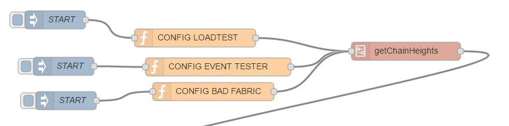
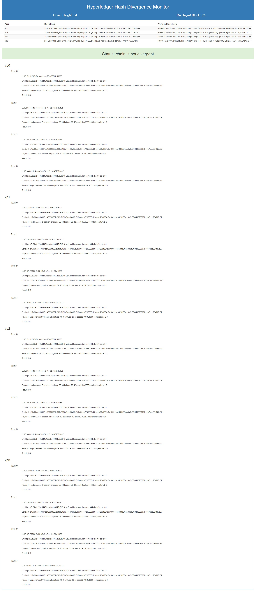
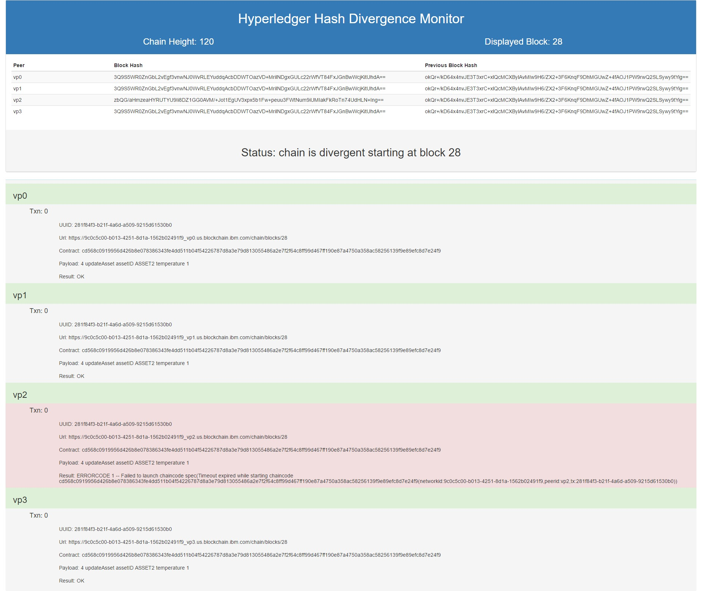
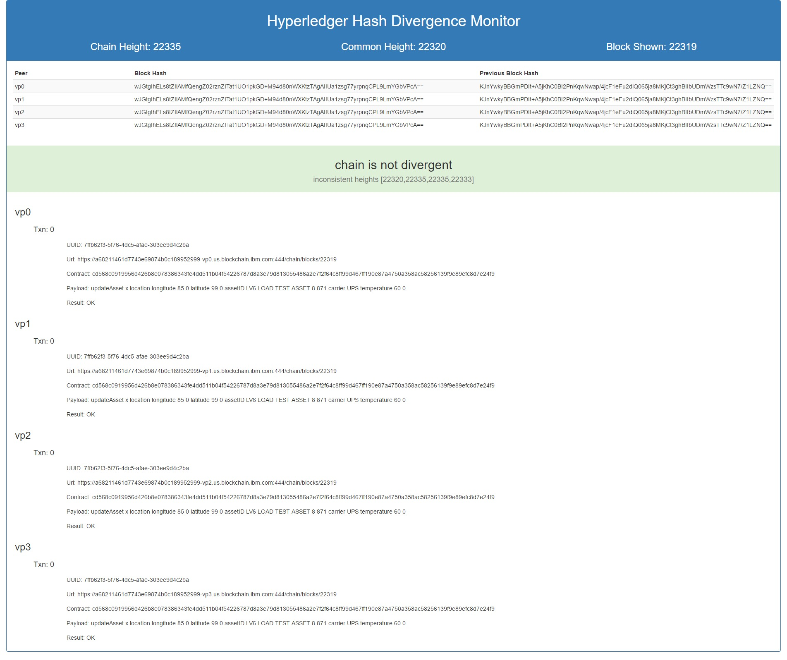

# Hyperledger Hash Divergence Monitor

## How This Flow Works

The primary flow is called "DivergentBlockChain" and is responsible for checking to see if the chain id divergent (as in corrupted) and then finding the block and transaction that caused the corruption.

You configure a minimum of 3 peer URLs pointing to members of the same Hyperledger fabric. You can then set your injection node to run the flow only once, or to run the flow periodically. Note that it takes a minimum of 20s to find a divergent block, so it is a good idea to have the polling timer set at a minute or more. 

The flow retrieves the hash and previous hash values from the top of the chain using the <url>/chain REST command and calculates whether there is divergence. If there is, it then launches a binary search for the first divergent block and reports on the contents of that block (transactions and their errors), decoding the chaincode ID and payload in order to help point to the area of investigation most likely to bear fruit on determining the cause of the chaincode divergence.

The flow writes results to a file in a sub folder based off the folder in which you started node-red. The folder is called status, and the file is called `status.json`.

## settings.js

Node-red uses a default `settings.js` file to configure the execution environment, and this can be overridden, as shown in the next section with the -s parameter. This project overrides that with `divergentBC.js`.

## Starting Node-Red to Use This Flow

While in the folder where you have dropped the flow (which can be the folder in which you have forked this project from blockchain-samples), you can issue a command similar to this Windows 10 example:

`C:\Users\kim\DEV\divergentBC>node-red -s divergentBC.js --userDir c:\users\kim\DEV\`

This will start node-red using the divergentBC.json flow file. If you were to change the flow and deploy it, you would change this file and it would start with your changes intact the next time you issued the command.

## Configuring This Flow

The main flow starts with an injection point at the top left and continues through a simple configuration node that defines the set of URLs used in the rest of the flow and the subflows.

For example:

``` json
var peers = [
    "https://<your fabric url for vp0 here>:444",
    "https://<your fabric url for vp1 here>:444",
    "https://<your fabric url for vp2 here>:444",
    "https://<your fabric url for vp3 here>:444",
];
global.set("peers", peers)
```

>Note that you don't need to specify the port if the https default 443 is used.

The injection and configuration nodes can be duplicated so that several fabrics can be monitored, although each will overwrite the status file, so this works best when injecting each configuration manually. This looks like:



## Visualizing the Results

A second flow called "WEB STATUS" provides a simple visualization of the status output by retrieving and formatting the `status.json` file. In order to present the fairly complex dataset in HTML, the function node called `morph` recasts the data into a form that can be easily iterated using mustache format in the HTML template. Bootstrap is used to provide a reasonably modern output format.

> The non-divergent example also shows how multiple transactions are rendered.



> The divergent display changes both the banner and the offending transaction background color to bootstrap's "danger" color.



Pointing a browser at `http://localhost:1890/status` will show the monitor. The tab in which the monitor displays can be set to refresh periodically for ongoing monitoring. The author does this using the chrome plugin [Auto Refresh](http://64px.com/auto-refresh/ifooldnmmcmlbdennkpdnlnbgbmfalko) to perform this task. While simplistic, it is very effective for such a simple flow.

## Visualizing Busy Blockchains and Contracts

When a peer is involved in heavy message traffic, its chain height can fall behind the rest of the peers. This led the flow to conclude that it could not measure divergence, so a mechanism to calculate the lowest and highest chain heights was added. The lowest chain height is passed on to the divergence calculation while the highest is used as the actual chain height of the fabric.

In this way, the divergence calculation never falls far behind the maximum chain height.

> The inconsistent heights example comes from a live system that is running long term tests.



## Console Output

This application makes extensive use of the console and it is worth keeping the console visible if your fabric is unreliable and has a lot of errors and timeouts. Following is the output from a successful binary search on a divergent fabric.

``` json
COMPARE HEIGHTS
HEIGHT: 118
chain is not divergent
GET CHAIN HEIGHTS
CHAIN HEIGHTS, HAVE 4/4
COMPARE HEIGHTS
HEIGHT: 118
ENTER BINARY SEARCH
GET BLOCK FROM PEERS: 59
BLOCK [59] RESPONSES, HAVE 4/4
RETURNING HASHES FROM GET BLOCK
[ 'luPveMsUlDu09/pNyQHGRST5mPiInoplRUpMnex5XFSxD22l5O5WXq8R8faJ6ELBtkPMpSEeuahUuoNGuSDtow==',
  '/EAM7fhSPgounB17sPCQtRDHjVDDieh86KLoasUYZNYao2fg0oHIIFzrDWvVJO5J/ACTx+040bapXTaRGXK2Mw==',
  '6xANL1elBpPv2HoHUVtotfl+1O4sTWLhDNNESrAcl5r3LyL3mgqlfsY29Q7ymReI6NkpnqrMu5Xo4KOt1bKjgw==',
  '/EAM7fhSPgounB17sPCQtRDHjVDDieh86KLoasUYZNYao2fg0oHIIFzrDWvVJO5J/ACTx+040bapXTaRGXK2Mw==' ]
NOT SAME
GET BLOCK FROM PEERS: 30
BLOCK [30] RESPONSES, HAVE 4/4
RETURNING HASHES FROM GET BLOCK
[ 'OLvh7gawrcB6tDf0FLZqRsq4Hh+v0Z4op2INrmtObiMcgNJQEv8/ZiadcxTNY7AlLkFw26NUS3m+HqnIUfAsOA==',
  'OLvh7gawrcB6tDf0FLZqRsq4Hh+v0Z4op2INrmtObiMcgNJQEv8/ZiadcxTNY7AlLkFw26NUS3m+HqnIUfAsOA==',
  'RwBwiEEjvaGH1jnhy8ShFaU54/j7SqOoX/A8+5lP0/0LvL0jfKmgdMv2K0bwe0G6nJ3Bxv4LDKw5xMhjRD48GQ==',
  'vgdd37fZ4f/pssYGg2dBbCdnUTJ8ZFo4knuTJJKyTZ0lbtJ3SWOoXdxsqN7x/DQep8u6hYRxWSu8nyCeKNgOkA==' ]
NOT SAME
GET BLOCK FROM PEERS: 16
BLOCK [16] RESPONSES, HAVE 4/4
RETURNING HASHES FROM GET BLOCK
[ 'RmGuVocddQ0Jxb9NKSLJAFlvr4IMgwEg1fXLG0wEiDl+pN4F98AXEr4HQzKgS13lZz54wW/zGE5g0cXEoSXSRQ==',
  'RmGuVocddQ0Jxb9NKSLJAFlvr4IMgwEg1fXLG0wEiDl+pN4F98AXEr4HQzKgS13lZz54wW/zGE5g0cXEoSXSRQ==',
  'RmGuVocddQ0Jxb9NKSLJAFlvr4IMgwEg1fXLG0wEiDl+pN4F98AXEr4HQzKgS13lZz54wW/zGE5g0cXEoSXSRQ==',
  'RmGuVocddQ0Jxb9NKSLJAFlvr4IMgwEg1fXLG0wEiDl+pN4F98AXEr4HQzKgS13lZz54wW/zGE5g0cXEoSXSRQ==' ]
SAME
GET BLOCK FROM PEERS: 23
BLOCK [23] RESPONSES, HAVE 4/4
RETURNING HASHES FROM GET BLOCK
[ 'arHQjUQvjTJRDzMU16ntc/BHLM1XxfLdj6GJbsJ3e1XkMFFaSFABlCfIVl5qI3QagIuVFIYuNghDr7BJhhrapA==',
  'arHQjUQvjTJRDzMU16ntc/BHLM1XxfLdj6GJbsJ3e1XkMFFaSFABlCfIVl5qI3QagIuVFIYuNghDr7BJhhrapA==',
  'arHQjUQvjTJRDzMU16ntc/BHLM1XxfLdj6GJbsJ3e1XkMFFaSFABlCfIVl5qI3QagIuVFIYuNghDr7BJhhrapA==',
  'arHQjUQvjTJRDzMU16ntc/BHLM1XxfLdj6GJbsJ3e1XkMFFaSFABlCfIVl5qI3QagIuVFIYuNghDr7BJhhrapA==' ]
SAME
GET BLOCK FROM PEERS: 27
BLOCK [27] RESPONSES, HAVE 4/4
RETURNING HASHES FROM GET BLOCK
[ 'zbQG/aHmzeaHYRUTYU9Ii8DZ1GG0AVM/+Jot1EgUV3xpx5b1Fw+peuu3FWtNum9iUMIakFkRoTn74UdHLN+Ing==',
  'zbQG/aHmzeaHYRUTYU9Ii8DZ1GG0AVM/+Jot1EgUV3xpx5b1Fw+peuu3FWtNum9iUMIakFkRoTn74UdHLN+Ing==',
  'zbQG/aHmzeaHYRUTYU9Ii8DZ1GG0AVM/+Jot1EgUV3xpx5b1Fw+peuu3FWtNum9iUMIakFkRoTn74UdHLN+Ing==',
  'zbQG/aHmzeaHYRUTYU9Ii8DZ1GG0AVM/+Jot1EgUV3xpx5b1Fw+peuu3FWtNum9iUMIakFkRoTn74UdHLN+Ing==' ]
SAME
GET BLOCK FROM PEERS: 29
BLOCK [29] RESPONSES, HAVE 4/4
RETURNING HASHES FROM GET BLOCK
[ 'RwBwiEEjvaGH1jnhy8ShFaU54/j7SqOoX/A8+5lP0/0LvL0jfKmgdMv2K0bwe0G6nJ3Bxv4LDKw5xMhjRD48GQ==',
  'EQa4k7iqgbTmGYEJlCUMOvKk1Q2hYkpLDp/rkdrckXhs8ZfoVzWmybYHYpieps3cfA49IVkSwvols9dTrSEeEg==',
  'RwBwiEEjvaGH1jnhy8ShFaU54/j7SqOoX/A8+5lP0/0LvL0jfKmgdMv2K0bwe0G6nJ3Bxv4LDKw5xMhjRD48GQ==',
  'RwBwiEEjvaGH1jnhy8ShFaU54/j7SqOoX/A8+5lP0/0LvL0jfKmgdMv2K0bwe0G6nJ3Bxv4LDKw5xMhjRD48GQ==' ]
NOT SAME
GET BLOCK FROM PEERS: 28
BLOCK [28] RESPONSES, HAVE 4/4
RETURNING HASHES FROM GET BLOCK
[ '3Q9S5WR0ZnGbL2vEgf3vnwNJ0WvRLEYuddqAcbDDWTOazVD+MrilNDgxGULc22rWfVT84FxJGnBwWcjKitUhdA==',
  '3Q9S5WR0ZnGbL2vEgf3vnwNJ0WvRLEYuddqAcbDDWTOazVD+MrilNDgxGULc22rWfVT84FxJGnBwWcjKitUhdA==',
  '3Q9S5WR0ZnGbL2vEgf3vnwNJ0WvRLEYuddqAcbDDWTOazVD+MrilNDgxGULc22rWfVT84FxJGnBwWcjKitUhdA==',
  'zbQG/aHmzeaHYRUTYU9Ii8DZ1GG0AVM/+Jot1EgUV3xpx5b1Fw+peuu3FWtNum9iUMIakFkRoTn74UdHLN+Ing==' ]
NOT SAME
DIVERGENT BLOCK: 28
FINAL RESPONSES FROM SEARCH
OUTPUT FROM BINARY SEARCH FLOW
{
  here it shows the entire response from the status file
}
```